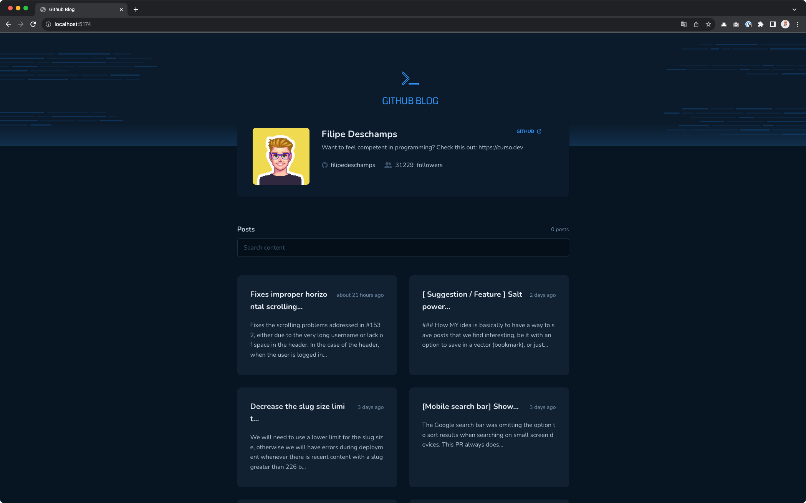
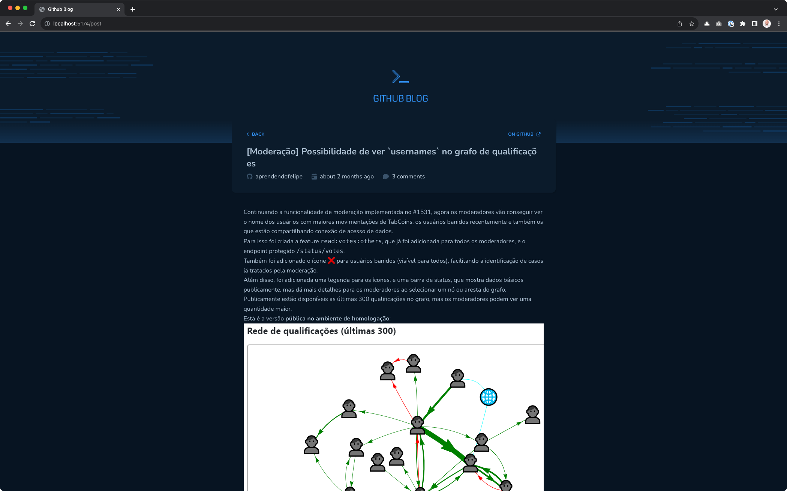
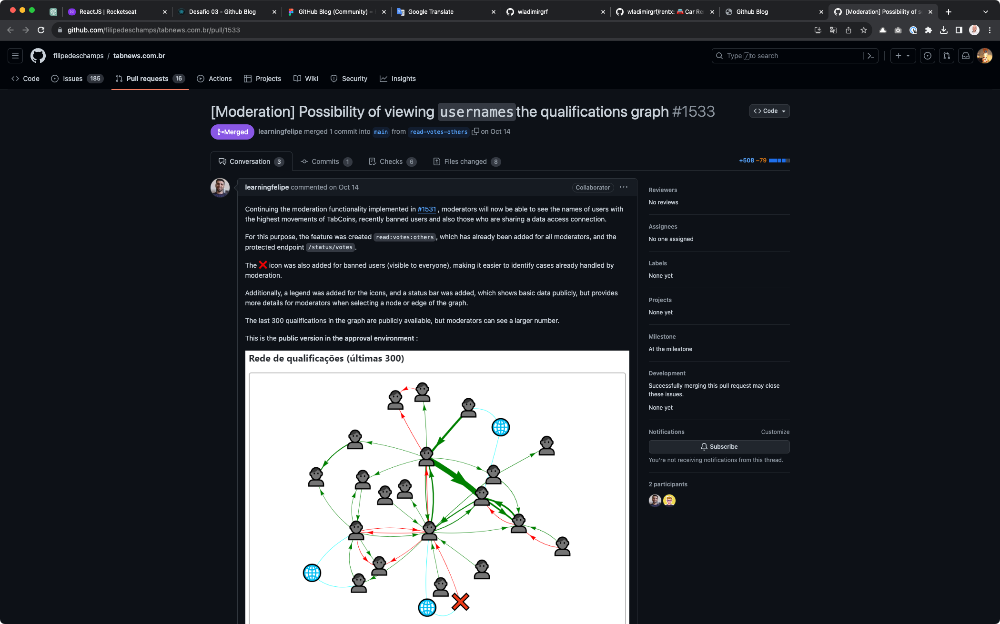

### Challenge 02 - Coffee Delivery





#### 💻 Getting started

To-do list-based application created with Vite + React.

Follow the steps below:
```bash
# Project dependencies
$ npm i

# Make a copy of '.env.sample'
# Fill up with YOUR environment variables
$ cp .env.sample .env

# Start the app
$ npm run dev
```

The application will be initialized on the port: `5174`

#### 🔗 Challenge link
https://efficient-sloth-d85.notion.site/Desafio-03-Github-Blog-13593953670346908462ddc648d42cf1